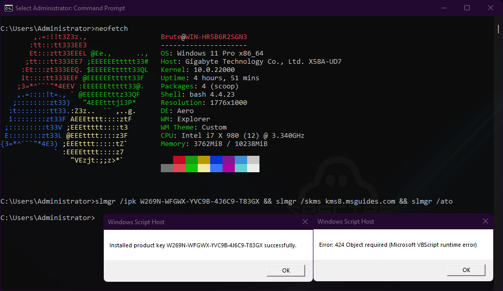

# Windows-11-Activator
To activate windows 11 un this simple 1 line command in Command Promt AS ADMIN!!!

"slmgr /ipk W269N-WFGWX-YVC9B-4J6C9-T83GX && slmgr /skms kms8.msguides.com && slmgr /ato"

Or run these 3 commands seperately in Command Prompt AS ADMIN!!!

1. "slmgr /ipk W269N-WFGWX-YVC9B-4J6C9-T83GX"
2. "slmgr /skms kms8.msguides.com"
3. "slmgr /ato"

Congrats! Your windows 11 is now activated!

[Note: i have a modifeid version of Windows 11 (Ghost Spectre) which is already pre activated so the message can be different than mine.]

  

